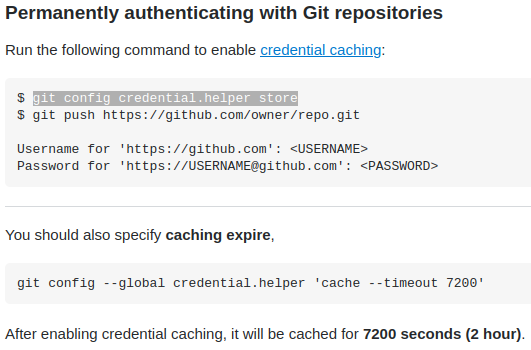

**If you have already cloned the git URL this will be the Error** 
 
*Solution: None but you might have an old one. Do: **git pull***  
**If there are changes in the remote github from your locally cloned one 
and you try to push new files, you git this error:** 
 
Getting tired of login in every time you push? 
 
